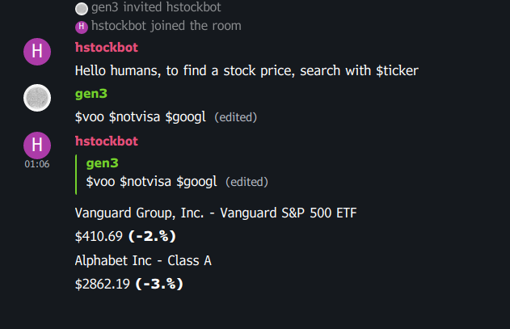

# Halcyon stock bot
Hello! This is an example / template bot using the [halcyon](https://github.com/WesR/Halcyon) matrix bot library. Feel free to ask questions in the matrix chat [#halcyon:blackline.xyz](https://matrix.to/#/#halcyon:blackline.xyz)

## Bot goals
This bot will
1. Sit in a room, and respond with the current price of a stock when some calls the ticker. For example "Hey guys, did you see that $UVKY just spiked?"
2. Respond with the
	+ Stock name
	+ Current price
	+ Todays Percent change
3. Join rooms via invite
4. Set its status message


## Requirments
1. A matrix account for the bot
2. An free api key from [IEX](https://iexcloud.io/s/ec26bc7b)
3. A place to run the bot

## Bot setup
1. Install Halcyon `python3 -m pip install halcyon`
2. Create a Halcyon token `python3 -m halcyon -s server.xyz -u @hstockbot:server.xyz -p "password"`
3. Save the above key, and along with your IEX key in a file called `creds.json`, formatted like below.
```json
{
	"halcyon":"eyJ0e==",
	"iex": "pk_12",
	"iex_dev":"Tpk_78"
}
```
4. Run the bot `python3 bot.py`
5. Invite the bot to an unencrypted room, and give it a test


